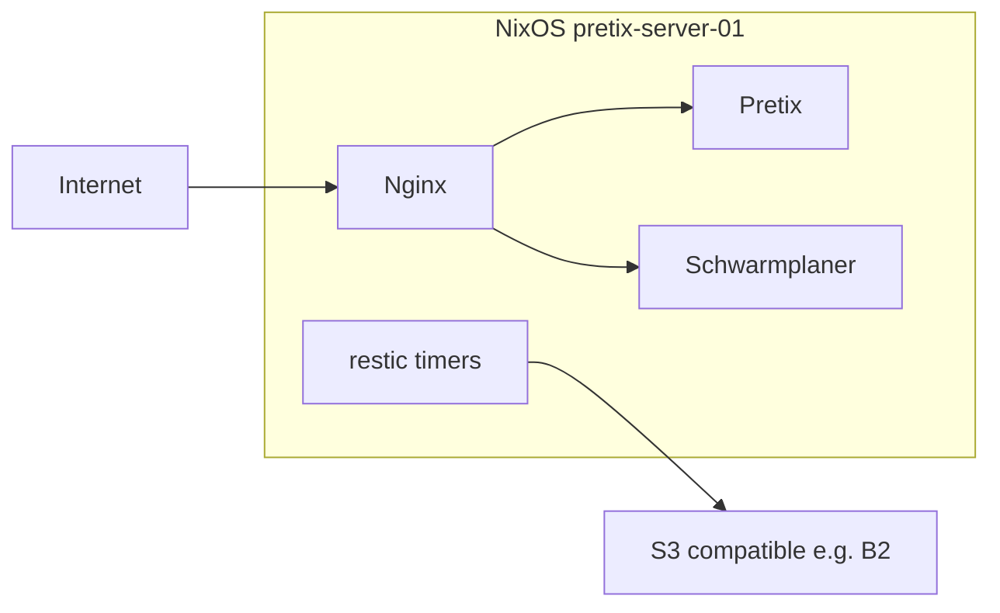

# Architecture (codemap)

NixOS flake for Zugvögel Festival: one host config `pretix-server-01`, services under `zugvoegel.services.*`, secrets via sops-nix.

## Where to change what

- **Services, hosts, ports, backup jobs:** `configuration.nix`
- **New NixOS module:** `modules/<name>/default.nix` (auto-exported in `flake.nix` via `readDir ./modules`)
- **Secrets:** `secrets/secrets.yaml` + `.sops.yaml`
- **Disk / mounts:** `hardware-configuration.nix` (+ disko when used)
- **Deploy from this checkout:** `./deploy.sh` (host baked into script)

## Flake

- Outputs: `nixosConfigurations.pretix-server-01` imports `configuration.nix`, all `modules/*/`, `disko`, `sops-nix`.
- Inputs: `nixpkgs` (unstable), `disko`, `sops-nix`, `bank-automation` flake.

## Modules (current tree)

- `modules/pretix` — Pretix in Docker; Postgres/Redis; nginx + ACME.
- `modules/schwarmplaner` — per-instance Docker stacks; nginx; optional `deploy` user + sudo for CI (`deployAuthorizedKeys`).
- `modules/backup` — `services.restic.backups` per named service; shared `backup-envfile` / `backup-passwordfile`; wraps `scripts/backup-restore.sh` as `backup-restore` in `$PATH`.
- `modules/monitoring` — Grafana / Loki / Prometheus / Promtail (options under `zugvoegel.services.monitoring`).
- `modules/bank-automation` — flake input package + scheduling.
- `modules/wedding-catcher` — optional Docker app (often disabled in `configuration.nix`).

## Invariants

- All custom services use namespace `config.zugvoegel.services.<name>` (see each module’s `options`).
- Secrets: never commit plaintext; edit with `sops secrets/secrets.yaml`. Runtime paths under `/run/secrets/` (sops-nix).
- Schwarmplaner GitHub deploy uses **unprivileged** `deploy` user, not root SSH keys.
- Backup repo URL shape: `${s3BaseUrl}/${bucketPrefix}-${serviceName}` (see `modules/backup/default.nix`).

## Flow (high level)

## Cross-cutting

- Firewall: public 80/443; Docker bridges often `trustedInterfaces`.
- After `nixos-rebuild switch`, root user dbus warnings on reload are a known benign noise on some hosts.
